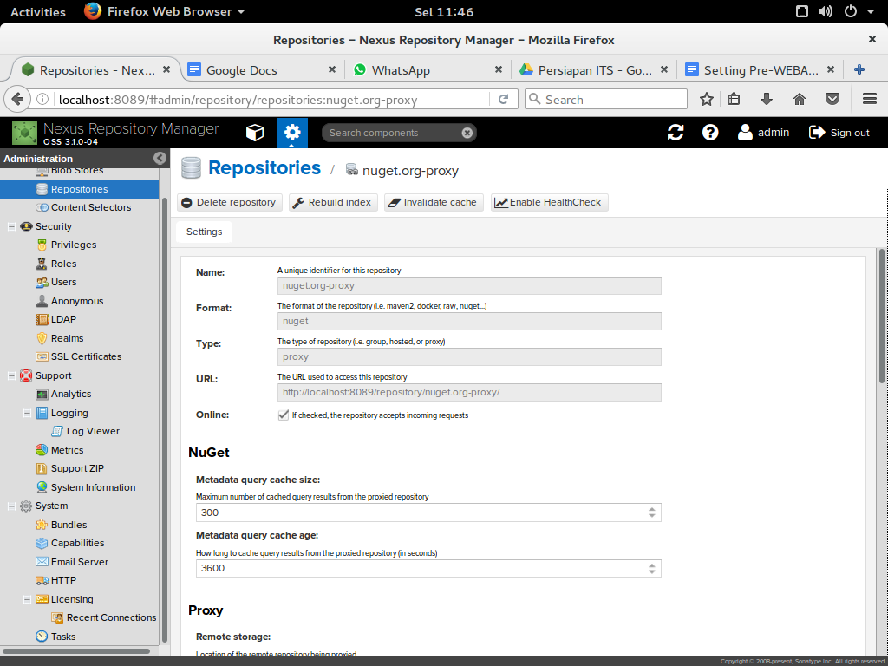

## **5.2 Windows** {#5-2-windows}

Node.js telah menyediakan installer untuk distribusi Windows, anda dapat mengunduh di [http://nodejs.org/download/](http://nodejs.org/download/).

**6\. Installasi NPM**

1.  Masuk ke terminal ( **ctrl + alt + t** )
2.  Ketikkan : $ sudo npm install npm@latest -g

( untuk install npm versi terakhir / terbaru )

**7\. Installasi Bower**

1.  Sebelum install bower, pastikan npm sudah terinstall
2.  L $ sudo npm install bower -g
3.  alu masuk ke terminal ( **ctrl + alt + t** )
4.  Ketikkan :

4\. Untuk mengecek versi dari bower, ketikkan : $ npm -v

**8\. Installasi GRUNT CLI**

1.  Sebelum install grunt, pastikan npm sudah terinstall
2.  Lalu masuk ke terminal ( **ctrl + alt + t** )
3.  Ketikkan : $ npm install -g grunt -cli

**9\. Installasi Nexus**

1.  Pertama download Nexus Sonatype di sini: [https://www.sonatype.com/download-oss-sonatype](https://www.sonatype.com/download-oss-sonatype)
2.  Buat folder “ NEXUS” di home.
3.  Pindahkan file yang telah terdownload ke folder “NEXUS”.
4.  Extract file, di dalam file yang telah di extract terdapat 2 folder.

5\. Buka terminal ( **ctrl + alt +t** ).

6. Masuk ke dalam folder “ NEXUS -&gt; nexus-3.1.0-04-unix -&gt; nexus-3.1.0-04 -&gt; bin “.

7. Setelah terminal masuk ke dalam folder “bin”. Ketikkan :

$ ./ nexus start 

8. Lalu ketikkan di browser: localhost:8081

Tampilan nexus siap digunakan :

9. Sign in dengan :

Username : admin

Password : admin123

10\. Klik menu Repository

11\. Pilih sub menu Repositories

12\. Klik tombol Create Repository , lalu pilih bower (group)

13\. Klik tombol Create Repository , lalu pilih bower (public)

10\. Setting Maven untuk bekerja dengan Nexus

Tambahkan setting dibawah ini pada file setting.xml, ${user.home}/.m2/settings.xml

1.  &lt;settings&gt;
2.  ...
3.  &lt;mirrors&gt;
4.  &lt;mirror&gt;
5.  &lt;id&gt;nexus&lt;/id&gt;
6.  &lt;name&gt;Nexus Central&lt;/name&gt;
7.  &lt;url&gt;http://urlnexus&lt;/url&gt;
8.  &lt;mirrorOf&gt;central&lt;/mirrorOf&gt;
9.  &lt;/mirror&gt;
10.  &lt;/mirrors&gt;
11.  ...
12.  &lt;/settings&gt;

11\. Setting NPM untuk bekerja dengan Nexus

Install npmrc dengan perintah:

$ npm install -g npmrc

$ npmrc -c meruvian

$ npmrc meruvian

$ npm config set registry “url repo public nexus”

Informasi lebih lanjut dapat melihat: https://www.npmjs.com/package/npmrc